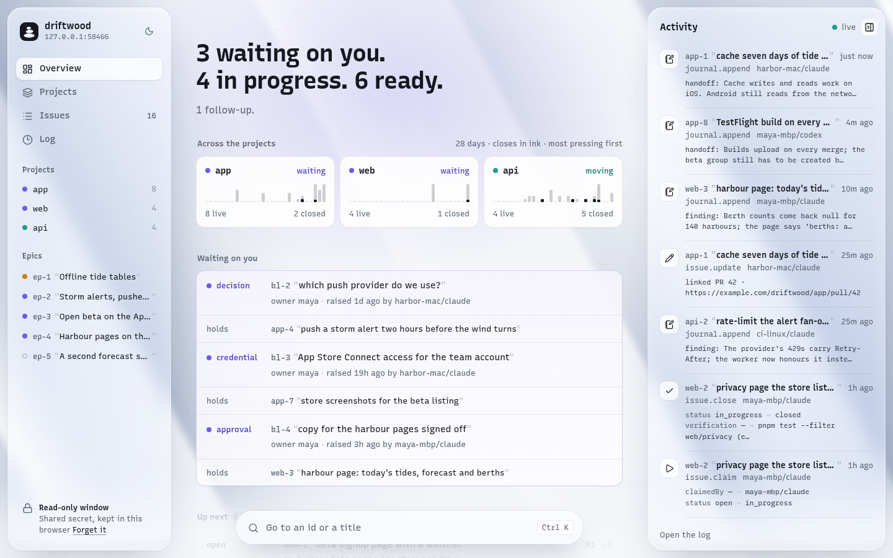
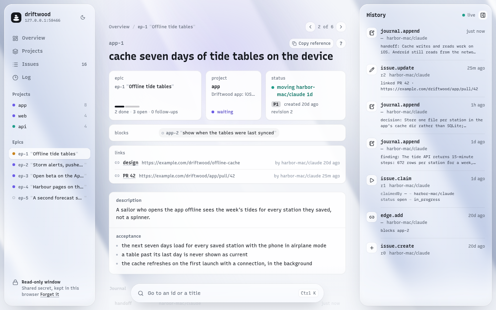

# cairn

**A shared worklist for coding agents, kept on your own Convex deployment.**

## Get started

You need Claude Code, git, and macOS or Linux (on Windows, WSL). Setup makes a free Convex
account in the browser if you have none.

Open Claude Code in the repository you want a worklist for, and paste:

```text
Set up cairn for me: clone https://github.com/sandstrom99/cairn to ~/.local/share/cairn and install it the way ~/.local/share/cairn/docs/install.md's "1. Install `cn`" section says, then read ~/.local/share/cairn/plugins/cairn/commands/init.md and follow it with me for this repository.
```

Claude asks before each command it runs. You finish a Convex login in the browser, name
the worklist and its projects, and choose where its secret is kept. The next session in
the repository opens with the worklist in front of it. Then talk to it:

- "What's next?"
- "Track this as an issue."
- "This looks stuck."
- "What happened to the storm alerts epic?"

[What setup does](#what-setup-does) shows each step it runs.

> [!TIP]
> First time? Try it on a small project of its own, a side project or a scratch
> repository, before your main codebase. A few sessions there show how agents claim,
> journal and close work, and what the brief and the page tell you, with nothing at stake.

### Joining a worklist that exists

A colleague's machine, or another of your own, joins a worklist that is already there and
creates nothing. Ask whoever runs it for the deployment's URL, which ends in
`.convex.cloud`, and for its secret: a 1Password item you can read, or the secret itself,
saved to `~/.config/cairn/<name>.secret` with mode 600 and never pasted into a chat. Then
open Claude Code anywhere and paste:

```text
Join an existing cairn worklist from this machine: clone https://github.com/sandstrom99/cairn to ~/.local/share/cairn and install it the way ~/.local/share/cairn/docs/install.md's "1. Install `cn`" section says, then read ~/.local/share/cairn/plugins/cairn/commands/init.md and follow it with me. The deployment already exists, so ask me for its URL and the command that prints its secret, and wire no repository unless I name one.
```

> [!WARNING]
> cairn is early. It has been in daily use on its own construction since 2026-09-17, and
> its shape still changes. Breaking changes to the CLI, the schema and the plugin are
> expected between commits, and there are no releases or migrations yet. Report problems
> as GitHub issues on this repository; [CONTRIBUTING.md](CONTRIBUTING.md) says how.

## What it is

Agents in Claude Code pick up work, write down what they find as they go, and close it
with the command that proved it. Every session on every machine opens on the same list.
People check in by asking in plain language and never have to run a command. A cairn is
the stack of stones a traveller leaves to mark the route for whoever comes next.

<picture>
  <source media="(prefers-color-scheme: dark)" srcset="docs/images/overview-dark.png">
  
</picture>

_A demo worklist, for a fictional team building a tide-and-weather app._

- **Epics, issues and blockers, and nothing else.** An epic is an outcome, an issue is
  the work, and a blocker is the work waiting on a person. Not a wiki, not an
  orchestrator, not a mirror of GitHub Issues.
- **It runs behind the scenes.** A Claude Code plugin opens every session with a short
  brief of where the work stands, and teaches the agent to claim an issue, journal what
  it finds, and close it.
- **Your own Convex deployment, one per company.** Convex is a hosted database that runs
  cairn's functions, and its free plan fits a worklist. There is no sync and nothing to
  merge: every agent and every machine reads the same deployment, live.
- **A web page for people.** The deployment serves it itself: read-only, live, and
  printing the same lines the agents read.
- **Proof on close.** Closing an issue runs the command that proves the work and records
  its exit code. A close without proof leaves a follow-up that owes it.
- **A person's word ends a wait.** An agent resolves a blocker only by quoting what the
  person said.

An epic is an outcome, not a place, so one can span every part of what a company ships:

```text
epic  "Storm alerts"
 ├── issue  alert settings screen               [app]
 ├── issue  push when a warning is issued       [api]
 └── issue  storm banner on the harbour page    [web]
```

## How it works

```text
  you, in plain language
        │
        ▼
  a Claude Code session
    cairn plugin: the skill, the SessionStart brief, the Stop nudge
        │
        ▼
  cn  ── one typed call per verb ──►  your Convex deployment  ◄──  the web page
                                        one shared secret           a live subscription
                                        fences it
```

`cn` is the CLI the agents use. It works from any shell, so any agent can use it; the
plugin is what makes Claude Code use it without being told. Every session opens with a
brief like this:

```text
cairn · driftwood · harbor-mac/claude
projects        api · app · web
ready 6         web-1 "beta signup page with a waitlist" P1 · app-5 "alert settings: a wind threshold per boat" P2 · api-8 "pull wind and swell from Open-Meteo beside the current model" P2
in progress     app-1 "cache seven days of tide tables on the device" harbor-mac/claude 1d · yours · app-8 "TestFlight build on every merge to main" maya-mbp/codex 6h · web-3 "harbour page: today's tides, forecast and berths" maya-mbp/claude 3h · api-2 "rate-limit the alert fan-out per sea area" ci-linux/claude 1h
follow-ups      app-10 "verify: vibrate pattern for gale alerts" [verify]
waiting on you  3
```

Work is always named by id and title together, `app-14 "fix connection retry"`, so a
reference means something to whoever reads it, in any session on any machine.

<picture>
  <source media="(prefers-color-scheme: dark)" srcset="docs/images/issue-dark.png">
  
</picture>

## What setup does

The prompt hands Claude the install step and then `/cairn:init`, which works out what is
already done and does the rest with you, in this order:

```text
  you paste the prompt
   │
   ├─ 1. install cn ─────────────────── on this machine
   │     clone cairn to ~/.local/share/cairn, install vp and the Node it brings,
   │     put cn on PATH
   │
   ├─ 2. stand up a worklist ────────── on Convex, once per company; joining skips it
   │     you log in in the browser; Claude creates the Convex project cairn-<name>,
   │     puts a secret on its deployment, and pushes cairn's functions and page
   │
   ├─ 3. point this machine at it ───── in ~/.config/cairn and Claude Code
   │     cn init checks the deployment answers and takes the secret, then writes
   │     its URL and the command that prints the secret; the plugin is registered
   │
   └─ 4. wire this repository ───────── in .claude/settings.json and CLAUDE.md
         enable the plugin for this deployment, make a project for each thing
         the repository ships, and map its directories onto those projects
         │
         ▼
  the next session in the repository opens with the brief
```

What you are asked for along the way: a Convex login, a name for the worklist, its
projects, a name for this machine, and where the secret lives. The machine's name goes on
every claim and journal entry, so it carries yours as well, `harbor-mac` on Harbor's Mac:
nothing else tells your agents apart from a colleague's.

The secret is kept in 1Password or in a file only this machine reads, your choice. Claude
never sees it: it asks for the command that prints the secret, never the secret, and
`cn init` runs that command itself.

Where things end up:

| Where | What |
|---|---|
| `~/.local/share/cairn` | the install, a clone kept at `main`. `cn` and the plugin both run from it |
| `~/.config/cairn/` | the deployments this machine knows and their secrets, mode 600 |
| your Convex account | one project per worklist; its deployment holds the work, cairn's functions and the page |
| the repository | the plugin enabled in `.claude/settings.json`, or `settings.local.json` when only you use cairn there, and a `## cairn` section in `CLAUDE.md` |

The page is at the deployment's URL with `.convex.cloud` changed to `.convex.site`, and
`cn doctor` prints it. It asks for the secret once per browser.

Every step can be done by hand instead: [docs/install.md](docs/install.md).

## Read further

| | |
|---|---|
| [docs/install.md](docs/install.md) | setup by hand, updating an install, rotating or revoking a secret, trying cairn with no account |
| [docs/design.md](docs/design.md) | the design: every decision, what was deliberately left open, and the measurements behind both |
| [packages/cli/README.md](packages/cli/README.md) | `cn`: the files it reads and every verb; `cn <verb> --help` is each one's contract |
| [plugins/cairn/README.md](plugins/cairn/README.md) | the Claude Code plugin: the skill, the hooks and the slash commands |
| [AGENTS.md](AGENTS.md) | for an agent working on cairn itself: the layout, the toolchain and the verification table |
| [CONTRIBUTING.md](CONTRIBUTING.md) | reporting a problem and proposing a change |

## Why not beads

cairn was built after [beads](https://github.com/gastownhall/beads) failed under agent
load, and every failure was downstream of one design choice: beads keeps its store in
Dolt, a distributed version-controlled database. Concurrent ids collided on an
unmergeable counter, `bd close` lost 7 of 8 closes, and `--append-notes` persisted 3 of
16 writes. On one authoritative deployment those failures cannot happen: the sync layer
is not built better, it is deleted. [`docs/design.md` §15](docs/design.md) has the full
measurement.

## Contributing

Report problems and propose changes as GitHub issues. Pull requests are open to
collaborators only while cairn is this early. [CONTRIBUTING.md](CONTRIBUTING.md) says
what a good report carries and how a proposal is taken on.

## License

MIT, see [LICENSE](LICENSE).
